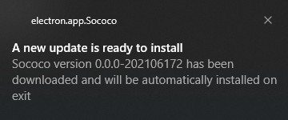
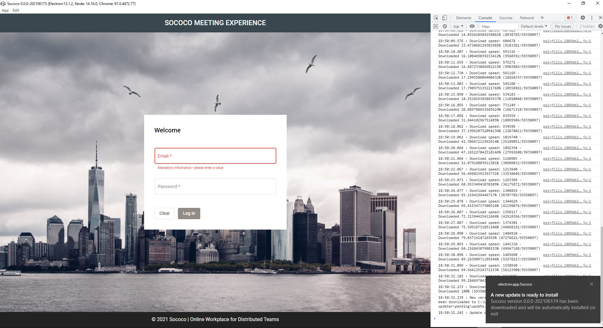

# Source and most of the ReadMe content below Cloned from
https://github.com/szwacz/electron-boilerplate.git

It uses https://www.electron.build/

## Sococo Readme

For general intro to electron builder, see the `Standard Readme` section below.

In order to release a new version and push it to github, you need to:

1) Configure github settings on build.publish section on package.json
2) Set the environment variable GITHUB_TOKEN. The value should be your or CI's Github token. [Read more here](https://www.electron.build/configuration/publish#githuboptions).
3) Run `npm run release`. This will push a new version (version string will come from the version you set on package.json)

For auto update to work, you need to:
1) Install the app by using the installer on the dist folder (this folder is created after running `npm run release`)
-Do not run the app directly from there - it won't update the version at that folder.
-When you run `npm start`, the app starts in dev mode. Auto update will not work on dev mode.
2) Run the app from the start menu of your OS
3) App will locate the new version (if any) and will install it.
4) Next time you run the app from the start menu, you will have the updated version.



You can set this environment variable (ELECTRON_ENABLE_LOGGING=1) to redirect electron console logs to Chrome console:




## Standard Readme (Cloned from electron-boilerplate repo)
# electron-boilerplate

Minimalistic, very easy to understand boilerplate for [Electron runtime](https://www.electronjs.org/). Tested on Windows, macOS and Linux.  

This project contains only bare minimum of tooling and dependencies to provide you with simple to understand and extensible base (but still, this is fully functional Electron environment). The boilerplate doesn't impose on you any frontend technologies, so feel free to pick your favourite.

# Quick start

Make sure you have [Node.js](https://nodejs.org) installed, then type...
```
npm install
npm start
```
...and you have a running desktop application on your screen.

# Structure of the project

The application consists of two main folders...

`src` - files within this folder get transpiled or compiled (because Electron can't use them directly).

`app` - contains all static assets which don't need any pre-processing and can be used directly.

The build process compiles the content of the `src` folder and puts it into the `app` folder, so after the build has finished, your `app` folder contains the full, runnable application. Treat `src` and `app` folders like two halves of one bigger thing.

The drawback of this design is that `app` folder contains some files which should be git-ignored and some which shouldn't (see `.gitignore` file). But this two-folders split makes development builds much faster.

# Development

## Starting the app

```
npm start
```

## The build pipeline

Build process uses [Webpack](https://webpack.js.org/). The entry-points are `src/main.js` and `src/app.js`. Webpack will follow all `import` statements starting from those files and compile code of the whole dependency tree into one `.js` file for each entry point.

[Babel](http://babeljs.io/) is also utilised, but mainly for its great error messages. Electron under the hood runs latest Chromium, hence most of the new JavaScript features are already natively supported.

## Environments

Environmental variables are done in a bit different way (not via `process.env`). Env files are plain JSONs in `config` directory, and build process dynamically links one of them as an `env` module. You can import it wherever in code you need access to the environment.
```js
import env from "env";
console.log(env.name);
```

## Adding npm modules to your app

Remember to respect the split between `dependencies` and `devDependencies` in `package.json` file. Your distributable app will contain only modules listed in `dependencies` after running the release script.

*Side note:* If the module you want to use in your app is a native one (not pure JavaScript but compiled binary) you should first  run `npm install name_of_npm_module` and then `npm run postinstall` to rebuild the module for Electron. You need to do this once after you're first time installing the module. Later on, the postinstall script will fire automatically with every `npm install`.

# Testing

Run all tests:
```
npm test
```

## Unit

```
npm run unit
```
Using [electron-mocha](https://github.com/jprichardson/electron-mocha) test runner with the [Chai](http://chaijs.com/api/assert/) assertion library. You can put your spec files wherever you want within the `src` directory, just name them with the `.spec.js` extension.

## End to end

```
npm run e2e
```
Using [Mocha](https://mochajs.org/) and [Spectron](http://electron.atom.io/spectron/). This task will run all files in `e2e` directory with `.e2e.js` extension.

# Making a release

To package your app into an installer use command:
```
npm run release
```

Once the packaging process finished, the `dist` directory will contain your distributable file.

[Electron-builder](https://github.com/electron-userland/electron-builder) is handling the packaging process. Follow dosc over there to customise your build.

You can package your app cross-platform from a single operating system, [electron-builder kind of supports this](https://www.electron.build/multi-platform-build), but there are limitations and asterisks. That's why this boilerplate doesn't do that by default.
